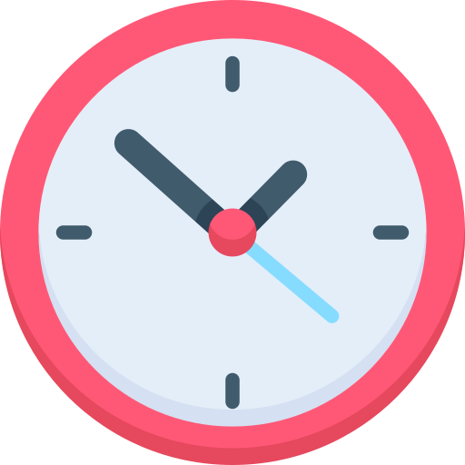
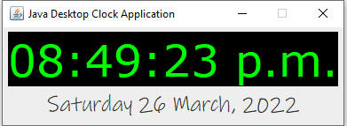

</a>

# Java Desktop Clock Application

# Table of Contents

- [Java Desktop Clock Application](#java-desktop-clock-application)
- [Table of Contents](#table-of-contents)
- [Screenshot of the Application](#screenshot-of-the-application)
- [Description](#description)
- [Packages Used](#packages-used)
- [System requirements](#system-requirements)
- [Source Code](#source-code)
- [Running the application as an executable](#running-the-application-as-an-executable)

---

# Screenshot of the Application

  

 
 - [Java Docs Reference to SimpleDateFormat Class](https://docs.oracle.com/javase/7/docs/api/java/text/SimpleDateFormat.html#text)

# Description

Simple GUI Application implementing Java Swing and [SimpleDateFormat](https://docs.oracle.com/javase/7/docs/api/java/text/SimpleDateFormat.html#text) class.

The application is wrapped as an executable application (.exe) using Launch4j and ready to go.

# Packages Used

- import java.awt.
- import java.text.
- import java.util.
- import javax.swing.

# System requirements

- JavaSE-1.8 or higher.

# Source Code

The project was developed in Eclipse IDE and all source code and projects are uploaded as an Eclipse project for convenience.

- Source code is available to view in the src folder
- Compiled code located in the bin directory.
- Jar File
- Executable (.exe) File
- Doc's file (javadocs)

# Running the application as an executable

As the project has already been compiled into an executable file, all you need to is:

- download the project and run Java-Desktop-Clock-Application.exe
- all other files are not required unless you wish to inspect the source code.
